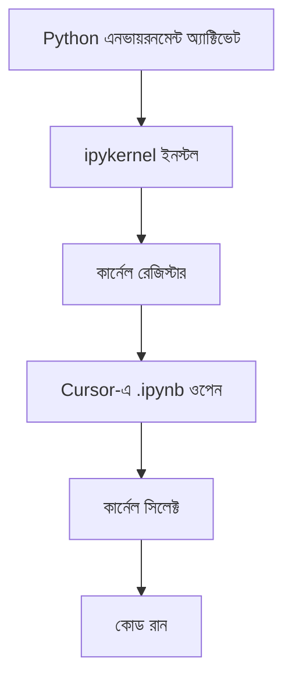

## ১. কেন Cursor এক্সটেনশন দরকার?

Cursor মূলত VS Code-এর ওপর বিল্ট, তাই VS Code মার্কেটপ্লেসের হাজারো এক্সটেনশন Cursor-এ কাজ করে । এক্সটেনশনগুলো Cursor-এর ক্ষমতা বাড়ায়:

| এক্সটেনশনের ধরন | কাজ |
|-----------------|-----|
| **Python** | পাইথন ডেভেলপমেন্ট সাপোর্ট (ইন্টেলিসেন্স, ডিবাগিং, লিন্টিং) |
| **Jupyter** | `.ipynb` ফাইল সাপোর্ট, ইন্টারঅ্যাকটিভ কোড সেল |
| **AI/LLM** | ক্লড, GPT, লোকাল মডেল ইন্টিগ্রেশন |
| **Git** | ভার্সন কন্ট্রোল ভিজুয়ালাইজেশন |

---

## ২. ধাপ ১: বেসিক এক্সটেনশন ইনস্টল করা

### কিভাবে এক্সটেনশন ইনস্টল করবেন?

1. **Cursor খুলুন**
2. **এক্সটেনশন ভিউ খুলুন**: সাইডবারে বর্গাকার আইকন বা `Ctrl+Shift+X` (Windows/Linux) / `Cmd+Shift+X` (Mac)
3. **সার্চ করুন** এবং ইনস্টল বাটনে ক্লিক করুন

### বাধ্যতামূলক এক্সটেনশন

| এক্সটেনশন আইডি | নাম | কাজ |
|----------------|------|-----|
| `ms-python.python` | **Python** | পাইথন ডেভেলপমেন্টের জন্য সবচেয়ে গুরুত্বপূর্ণ এক্সটেনশন। ইন্টেলিসেন্স, ডিবাগিং, টেস্টিং, লিন্টিং সাপোর্ট করে |
| `ms-toolsai.jupyter` | **Jupyter** | Jupyter Notebook (`.ipynb`) ফাইল সাপোর্ট করে। কোড সেল রান, আউটপুট দেখানো, ভেরিয়েবল এক্সপ্লোরার |
| `ms-toolsai.vscode-jupyter-cell-tags` | **Jupyter Cell Tags** | Jupyter সেল ট্যাগিং সাপোর্ট (সেল মেটাডাটা ম্যানেজমেন্ট) |
| `ms-toolsai.jupyter-keymap` | **Jupyter Keymap** | Jupyter-এর কীবোর্ড শর্টকাট Cursor-এ আনে |

> **Windows ব্যবহারকারীদের জন্য সতর্কতা:** Jupyter এক্সটেনশনের পাথ হ্যান্ডলিং ইস্যু থাকতে পারে । যদি কানেক্ট না হয়, তাহলে Cursor রিইনস্টল বা আপডেট করে দেখুন।

---

## ৩. ধাপ ২: Python এক্সটেনশন কনফিগার করা

Python এক্সটেনশন ইনস্টল করার পর নিচের সেটিংস কনফিগার করুন:

### 3.1 পাইথন ইন্টারপ্রেটার সিলেক্ট করা

Cursor-এর নিচের বাম কোণে পাইথন ভার্সন দেখাবে। সেখানে ক্লিক করে আপনার UV-র `.venv` সিলেক্ট করুন ।

### 3.2 লিন্টিং ও ফরমেটিং সেটআপ

Cursor সেটিংস খুলুন (`Ctrl+,`) এবং নিচের সেটিংস যোগ করুন:

```json
{
    "python.linting.enabled": true,
    "python.linting.pylintEnabled": false,
    "python.linting.flake8Enabled": true,
    "python.formatting.provider": "black",
    "editor.formatOnSave": true
}
```

### 3.3 Pylance (ল্যাংগুয়েজ সার্ভার)

Python এক্সটেনশনের সাথে Pylance অটোমেটিক ইনস্টল হয়। এটি দ্রুত কোড কমপ্লিশন ও টাইপ চেকিং করে।

---

## ৪. ধাপ ৩: Jupyter Notebook সেটআপ করা

Jupyter এক্সটেনশন ইনস্টল করার পর Notebook ব্যবহারের জন্য নিচের ধাপগুলো ফলো করুন :

### 4.1 জুপিটার চালানোর ধাপসমূহ



### 4.2 ভার্চুয়াল এনভায়রনমেন্টে ipykernel ইনস্টল

আপনার UV-র প্রজেক্টে Jupyter সাপোর্ট যোগ করুন:

```bash
# প্রথমে UV এনভায়রনমেন্ট অ্যাক্টিভেট করুন
source .venv/bin/activate  # Mac/Linux
# অথবা
.venv\Scripts\activate     # Windows

# ipykernel ইনস্টল করুন
pip install ipykernel

# UV দিয়ে ইনস্টল করতে চাইলে (আগের দিনের মতো)
uv add ipykernel jupyter
```

### 4.3 Jupyter কার্নেল রেজিস্টার করা

প্রতিটি পাইথন এনভায়রনমেন্টের জন্য আলাদা কার্নেল রেজিস্টার করতে হবে :

```bash
# বর্তমান এনভায়রনমেন্টকে Jupyter কার্নেল হিসেবে রেজিস্টার
python -m ipykernel install --user --name=my-llm-env --display-name="Python (my-llm-env)"
```

এখানে:
- `--name`: অভ্যন্তরীণ কার্নেল আইডি (ইউনিক রাখুন)
- `--display-name`: Cursor-এ যে নাম দেখাবে

### 4.4 Cursor-এ Jupyter ফাইল ওপেন ও কার্নেল সিলেক্ট

1. নতুন `.ipynb` ফাইল তৈরি করুন (`File → New File → Jupyter Notebook`)
2. অথবা `Ctrl+Shift+P` → "Create: New Jupyter Notebook"
3. উপরের ডান কোণায় "Select Kernel" বাটনে ক্লিক করুন
4. আপনি রেজিস্টার করা কার্নেল সিলেক্ট করুন (যেমন "Python (my-llm-env)")
5. প্রথম সেলে লিখুন: `print("Hello from Cursor Jupyter!")` এবং `Shift+Enter` চাপুন

### 4.5 কার্নেল ভেরিফাই করা

নিচের কোড রান করে চেক করুন সঠিক পাইথন এনভায়রনমেন্ট ব্যবহার করছে কিনা :

```python
import sys
print(sys.executable)
# আউটপুট আপনার .venv পাথ দেখাবে
```

---

## ৫. ধাপ ৪: Agent Rules ও ভাইব-টুলস ইনস্টল করা (অ্যাডভান্সড)

Cursor-এর AI ক্ষমতা বাড়ানোর জন্য কিছু অ্যাডভান্সড টুলস আছে।

### 5.1 Agent Rules (Cursor-Optimized)

এটি ৫০+ স্পেশালাইজড AI এজেন্টের একটি কালেকশন :

- `ai-engineer`: LLM অ্যাপ্লিকেশন, RAG সিস্টেম, প্রম্পট পাইপলাইন বানায়
- `python-pro`: ইডিওমেটিক পাইথন কোড লেখার জন্য
- `code-reviewer`: কোড রিভিউ ও নিরাপত্তা চেক
- `test-automator`: ইউনিট, ইন্টিগ্রেশন, ই২ই টেস্ট তৈরি

**ইনস্টলেশন**:
```bash
# রুলস কপি করুন
git clone https://github.com/Uralmans/agent_rules.git
cp agent_rules/rules/*.mdc .cursor/rules/
```

### 5.2 vibe-tools (AI টিম মেম্বার)

`vibe-tools` আপনার Cursor এজেন্টকে অতিরিক্ত ক্ষমতা দেয় :
- **web search**: Perplexity দিয়ে ওয়েব সার্চ
- **repo analysis**: পুরো কোডবেস বিশ্লেষণ (২ মিলিয়ন টোকেন কনটেক্সট)
- **browser operation**: ওয়েব অ্যাপ টেস্টিং ও ডিবাগিং
- **youtube analysis**: টিউটোরিয়াল থেকে সারাংশ বের করা

**ইনস্টলেশন** (Node.js 18+ দরকার):
```bash
npm install -g vibe-tools
vibe-tools install .
```

> **দ্রষ্টব্য:** vibe-tools-এর জন্য Perplexity API কী ও Google Gemini API কী দরকার ।

### 5.3 Claude Code Extension (ঐচ্ছিক)

Cursor-এ ক্লড মডেল ব্যবহার করতে চাইলে :

1. [রিলিজ পেজ](https://github.com/BlinkZer0/Cursor-Claude-Extension/releases) থেকে `.7z` ফাইল ডাউনলোড করুন
2. এক্সট্রাক্ট করুন: `~/.cursor/extensions/anthropic.claude-code-cursor-2.0.5-cursor/`
3. Cursor রিস্টার্ট করুন
4. `Ctrl+Escape` চেপে Claude Code ওপেন করুন

---

## ৬. ধাপ ৫: Jupyter-এ Cursor AI Agent ব্যবহার করা

Cursor 1.0 ভার্সন থেকে Jupyter Notebook-এর ভেতরেও Agent কাজ করে !

### Agent Mode চালু করা

1. Jupyter Notebook ওপেন করুন
2. Agent প্যানেল খুলুন (`Ctrl+I`)
3. Agent কে নির্দেশ দিন: *"এই ডাটাসেট বিশ্লেষণ করে একটি ভিজুয়ালাইজেশন তৈরি করো"*
4. Agent স্বয়ংক্রিয়ভাবে একাধিক সেল তৈরি ও এডিট করবে

> **নোট:** Jupyter-এ Agent মোড শুধু **Sonnet মডেল** সাপোর্ট করে ।

---

## ৭. ধাপ ৬: Windows-এ Jupyter সমস্যা সমাধান

Windows ব্যবহারকারীদের কিছু পরিচিত সমস্যা ও সমাধান:

### সমস্যা 1: "Invalid WIN32 path characters" Error

Cursor-এর Jupyter এক্সটেনশন কখনও কখনও `c:/Users/...` ফরম্যাট ব্যবহার করে যা Windows চেনে না ।

**সমাধান 1 (সহজ):**
- Cursor সম্পূর্ণভাবে বন্ধ করুন
- আবার ওপেন করুন (রিস্টার্ট)
- যদি না হয়, Cursor রিইনস্টল করুন

**সমাধান 2:**
```bash
# Jupyter রানটাইম ফোল্ডার ক্লিয়ার করুন
rm -rf ~/AppData/Roaming/Cursor/User/globalStorage/ms-toolsai.jupyter/
# তারপর Cursor রিস্টার্ট করুন
```

### সমস্যা 2: কোনো কার্নেল দেখাচ্ছে না

**সমাধান** :
```bash
# রেজিস্টার করা কার্নেল লিস্ট দেখুন
jupyter kernelspec list

# কোনো কার্নেল না থাকলে উপরের ৪.৩ ধাপ অনুসরণ করুন
```

### সমস্যা 3: মডিউল নট ফাউন্ড এরর

**সমাধান:**
```python
# কোন পাইথন ব্যবহার করছে চেক করুন
import sys
print(sys.executable)

# দরকারি প্যাকেজ ইনস্টল করুন
pip install pandas numpy matplotlib seaborn
```

---

## ৮. দরকারি Jupyter কীবোর্ড শর্টকাট

| শর্টকাট | কাজ |
|----------|------|
| `Shift+Enter` | বর্তমান সেল রান করে পরবর্তী সেলে যান |
| `Ctrl+Enter` | বর্তমান সেল রান করে (পরবর্তীতে যায় না) |
| `Alt+Enter` | সেল রান করে নিচে নতুন সেল যোগ করে |
| `A` | উপরে নতুন সেল যোগ (কমান্ড মোডে) |
| `B` | নিচে নতুন সেল যোগ (কমান্ড মোডে) |
| `D+D` | বর্তমান সেল ডিলিট (দুবার D চাপতে হবে) |
| `M` | সেলকে মার্কডাউন মোডে পরিবর্তন |
| `Y` | সেলকে কোড মোডে পরিবর্তন |
| `Esc` | এডিট মোড থেকে কমান্ড মোডে যান |
| `Enter` | কমান্ড মোড থেকে এডিট মোডে যান |

---

## ৯. প্রস্তাবিত এক্সটেনশন লিস্ট

আপনার এলএলএম ডেভেলপমেন্টের জন্য আরও কিছু দরকারি এক্সটেনশন:

| এক্সটেনশন | ব্যবহার |
|------------|---------|
| `GitHub.copilot` | AI কোড কমপ্লিশন (ঐচ্ছিক, Cursor-এর বিল্ট-ইন AI ইতিমধ্যেই আছে) |
| `eamodio.gitlens` | Git ভিজুয়ালাইজেশন ও হিস্ট্রি ট্র্যাকিং |
| `mechatroner.rainbow-csv` | CSV ফাইল ভিউ করার জন্য |
| `donjayamanne.python-extension-pack` | পাইথন এক্সটেনশন প্যাক (সব একসাথে) |
| `ms-toolsai.datawrangler` | ডাটা প্রিভিউ ও র‍্যাংলিং টুল |

---

## ১০. সারসংক্ষেপ (Summary)

আজকের সেশনে আমরা যা করলাম:

| ধাপ | কী শিখলাম |
|------|-----------|
| **বেসিক এক্সটেনশন** | ✅ Python ও Jupyter এক্সটেনশন ইনস্টল |
| **Jupyter সেটআপ** | ✅ `ipykernel` ইনস্টল ও কার্নেল রেজিস্টার |
| **Windows সমস্যা** | ✅ পাথ ইস্যু সমাধানের কৌশল |
| **অ্যাডভান্সড টুলস** | ✅ Agent Rules ও vibe-tools কনফিগারেশন |
| **Cursor Agent** | ✅ Jupyter-এ Agent মোড ব্যবহার |


